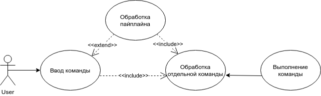
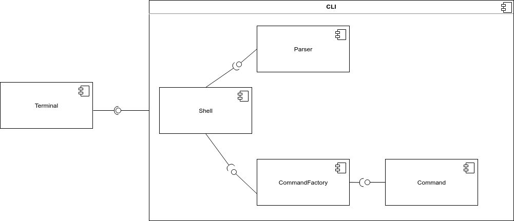
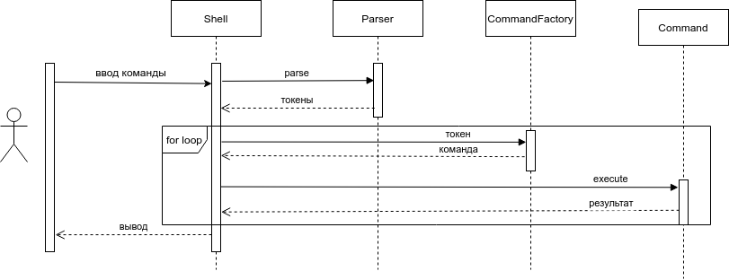

# CLI

Простой интерпретатор командной строки, поддерживающий команды:

 - cat [FILE] - выводит содержимое файла на экран
 - echo - выводит на экран свои аргументы
 - wc [FILE] - выводит количество строк, слов и байт в файле
 - pwd - выводит текущую директорию
 - exit - выходит из интерпретатора
 
 -------------------------------
**Запуск**
 
 `cd cli`
 
 `python3.6 ./run_cli.py`

 -------------------------------
**Диаграмма случаев использования**

**Диаграмма компонентов**

**Диаграмма последовательностей**

